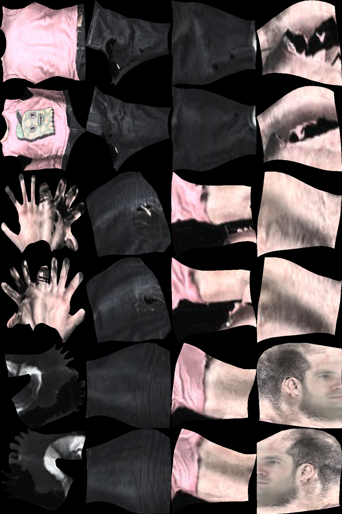

# Densepose2Texture

This is a Densepose to Texture model from Runway.

It takes an input UV image and a Texture image, returns an image with texture poses.
 +  = 

By chaining Densepose and Densepose2Texture together in runway, you can get the following effect:

### Credits / Source:
This is based on one of the [DensePose](https://github.com/facebookresearch/DensePose) notebooks: [
Texture Transfer Using Estimated Dense Coordinates](https://github.com/facebookresearch/DensePose/blob/master/notebooks/DensePose-RCNN-Texture-Transfer.ipynb)
